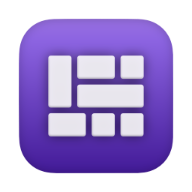
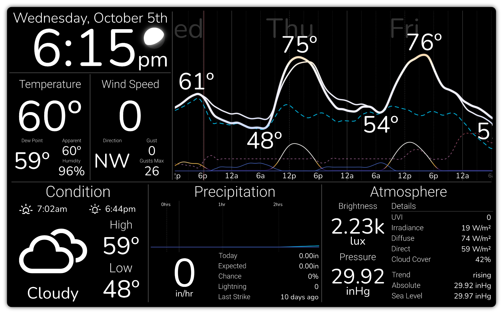

	

   
  

	<h1 align="center" color="505050">
		<strong><b>LevityDash</b></strong>
	</h1>
  

  	A lightweight, desktop native, multi-source dashboard for macOS, Windows and Linux
  

<picture>
	<source srcset="docs/_images/screenshot-readme.webp" type="image/webp">
	<source srcset="docs/_images/screenshot-readme.avif" type="image/avif">
	
</picture>

LevityDash aims to be a lightweight, desktop native, multi-source dashboard without a required web frontend that is fun and easy to use. The current version only supports PySide2/Qt. However, a key goal of this project is to support
multiple frontends and
platforms, including embedded.

*Note: This project is very much in the proof of concept stage – it functions, but it is far from the goal of a lightweight dashboard.*

# Current Features

## Backend

- Plugin system for adding new sources
- Scheduling API pulls
- Data/key maps for automatically parsing ingested data
- Unit library for automatic localization/conversion
- Conditional value updates. i.e. if wind speed is zero do not log the wind direction

### Data Sources

- REST API Pull
- Sockets (UDP, websocket, socket.io)
- BLE Advertisements

### Builtin Plugins

- [Open-Meteo](https://open-meteo.com) [REST]
- [WeatherFlow Tempest](https://tempestwx.com) [REST, UDP, Websocket(incomplete)]
- Govee BLE Thermometers/Hygrometers [[GVH5102](https://www.amazon.com/Govee-Hygrometer-Thermometer-Temperature-Notification/dp/B087313N8F?th=1)]

## Frontend

- Drag and drop dashboard design (This can be a little funky at times)
- YAML based dashboard specifications with support for both absolute and relative size/positioning
- Module grouping
- Editable Margins for text modules
- Resizable graph figures
- Custom, value mapped, gradients for figure items
- Text filters (i.e. lower, title, upper, digit to ordinal, etc.)

## Current Modules

- Realtime single line text with support for showing units and titles and mapping glyphs/emojis to values
- Timeseries Graph
- Customizable Clock
- Moon Phase
- Submodule Group for organizing modules

## Planned Modules

- Gauges [nearly complete]
- Weather Radar
- Multiline Text
- RSS Feeds
- Calendar
- Mini Graphs
- More plot types
