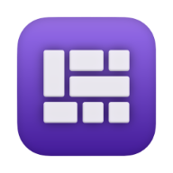
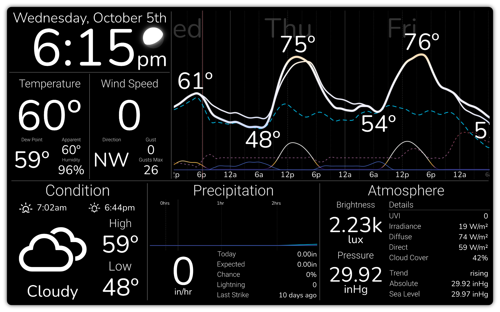

<div>
	<p align="center">
   
  </p>
	<h1 align="center" color="505050">
		<strong><b>LevityDash</b></strong>
	</h1>
  <p align="center">
  	A lightweight, desktop native, multi-source dashboard for macOS, Windows and Linux
  </p>

<picture>
	<source srcset="docs/_images/screenshot-readme.webp" type="image/webp">
	<source srcset="docs/_images/screenshot-readme.avif" type="image/avif">
	
</picture>

</div>

LevityDash aims to be a lightweight, desktop native, multi-source dashboard without a required web frontend that is fun and easy to use. The current frontend is built on PySide6/Qt 6. A key goal of this project is to support multiple frontends and platforms, including embedded — the backend/frontend process split that enables this is actively in progress (see the [roadmap](docs/roadmap.md)).

*Note: This project is in beta – it works and is used daily, but expect rough edges.*

<p align="right">


</p>

# Getting Started

## Requirements

- Python 3.13 – 3.14 (3.14 recommended — it's noticeably faster)
- [Poetry](https://python-poetry.org) for installing from source

## Install

> **Note:** The package on PyPI is an old 0.1.x release from the PySide2 era. Until 0.2.0 ships, install from source.

```bash
git clone https://github.com/noblecloud/LevityDash.git
cd LevityDash
poetry install --without dev
```

The `dev` dependency group expects a sibling checkout of the WeatherUnits repo (`../WeatherUnits`) for library development; `--without dev` skips it and uses the released WeatherUnits from PyPI.

## Running

```bash
poetry run LevityDash              # or: poetry run python -m LevityDash
```

To start over with a fresh configuration, use `poetry run LevityDash-reset-config`.

PySide6 ships prebuilt ARM64 wheels (macOS universal2 and, in recent releases, Linux aarch64), so a 64-bit OS such as Raspberry Pi OS 64-bit installs like any other platform. 32-bit ARM is not supported by Qt 6.

See the [documentation site](https://levitydash.app) for configuration, plugin setup, and troubleshooting.

# Current Features

## Backend

- Plugin system for adding new sources
- Scheduling API pulls
- Data/key maps for automatically parsing ingested data
- Unit library for automatic localization/conversion
- Conditional value updates. i.e. if wind speed is zero do not log the wind direction

### Data Sources

- REST API Pull
- Sockets (UDP, websocket, socket.io)
- BLE Advertisements

### Builtin Plugins

- [Open-Meteo](https://open-meteo.com) [REST]
- [PirateWeather](https://pirateweather.net) [REST]
- [WeatherFlow Tempest](https://tempestwx.com) [REST, UDP, Websocket]
- Govee BLE Thermometers/Hygrometers [[GVH5102](https://www.amazon.com/Govee-Hygrometer-Thermometer-Temperature-Notification/dp/B087313N8F?th=1)]
- [OpenWeatherMap](https://openweathermap.org) [REST, current conditions only — the free tier doesn't include forecast data]

## Frontend

- Drag and drop dashboard design (This can be a little funky at times)
- YAML based dashboard specifications with support for both absolute and relative size/positioning
- Module grouping
- Editable Margins for text modules
- Resizable graph figures
- Custom, value mapped, gradients for figure items
- Text filters (i.e. lower, title, upper, digit to ordinal, etc.)

## Current Modules

- Realtime text with support for showing units and titles and mapping glyphs/emojis to values
- Gauges
- Timeseries Graph and Mini Graph
- Customizable Clock
- Moon Phase
- Groups, titled groups, stacks, and value stacks for organizing modules

## Planned Modules

- Weather Radar
- Multiline Text
- RSS Feeds
- Calendar
- More plot types

See the full [roadmap](docs/roadmap.md) for what's done, in progress, and planned.